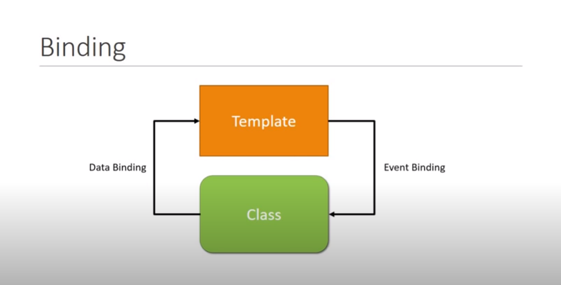
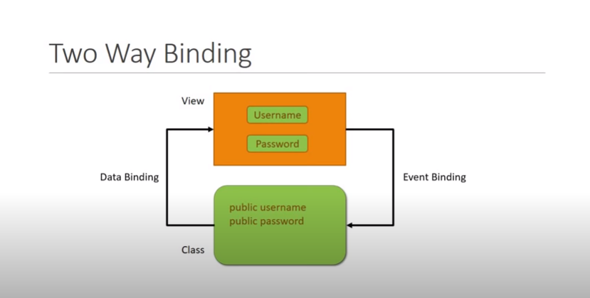
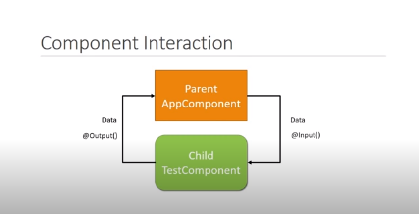
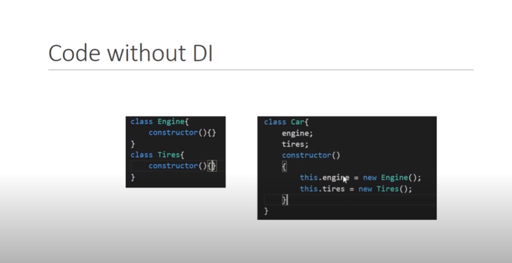
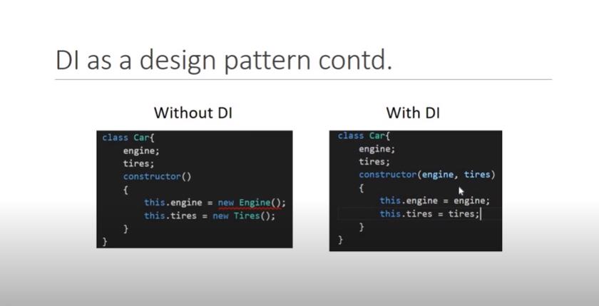
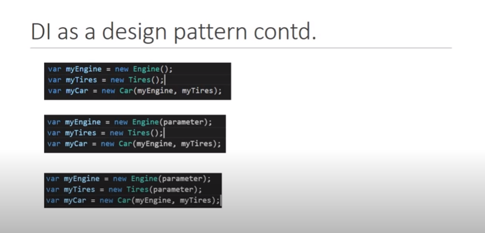
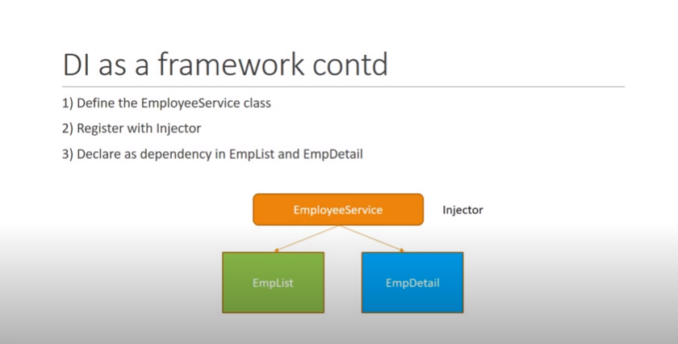
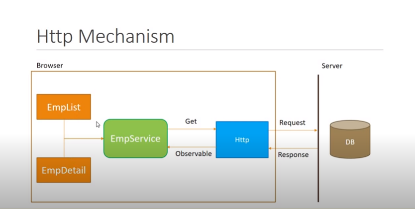
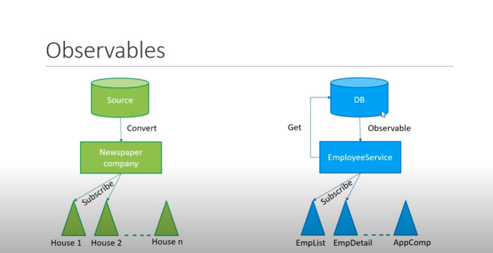
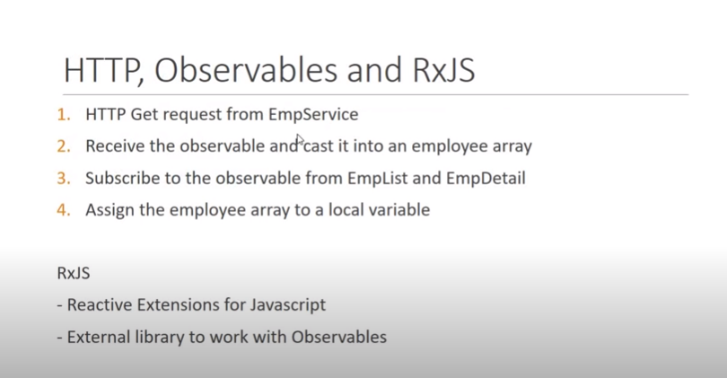

<p align="center">
	
</p>

### Start

+ Install Node and npm.

+ Using Angular CLI 10.0.4 

+ Use ```npm install -g @angular/cli``` to install the latest version using npm | Link : [How to update to latest version if already installed](https://stackoverflow.com/questions/43931986/how-to-upgrade-angular-cli-to-the-latest-version)


+ The very basics of Angular App is the ***Modules*** which then contains the **components**. Each component must contains two things, one is ***template (which is view/HTML)*** and other one is ***Class (A TrypeScript class)***, which contains logic to what's going to render on the Template.

+ As Angular is written using TypeScript, knowledge of TypeScript is required to work with Angular.

> Do note that Angular is a platform and client side framework which is is used for building single-page clinet applications using HTML and TypeScript.It implements core and optional functionality as a set of TypeScript libraries that you import into your apps.
Please refer [here](https://angular.io/guide/architecture) for more.

+ Do not confuse modules/components/services etc as they are some sort of folders, instead they are Modules, components and services are classes that use decorators. 


### Components

+ Angular components are consits of ***componentName.component.ts***, ***componentName.componet.html***,***componentName.component.css***.

+ Run ```ng g c component-name``` or you can also run ```ng generate component component-name```

+ The above command will generate(g) *component-name* component(c) for you inside app folder and also update the file ***app.module.ts***.

+ The component module class file (the TypeScript file) is consist of a Decorator ( `@Component()` ) that will tell Angular app that the just below Class is actually a Component for the app. The `@Component()` decorator identifies the class immediately below it as a component, and provides the template and related component-specific metadata.

<p align="center">

</p>

> There are many other Decorators available for Angular classes. Decorators are the functions that modify JavaScript classes. They provide some metadata about the class as what that class supposed to do. Decorators (also called annotations) are an experimental (stage 2) JavaScript language feature. TypeScript adds support for decorators.
Angular defines decorators that attach metadata to classes or properties so that it knows what those classes or properties mean and how they should work. 

+ ***Class decorators*** are decorator that appears immediately before a class definition, which declares the class to be of the given type, and provides metadata suitable to the type.

The following decorators can declare Angular class types:
```@Component()``` | ```@Directive()```  | ```@Pipe()``` | ```@Injectable()``` | ```@NgModule()```.

+ ***Class field decorators*** are decorator statement immediately before a field in a class definition that declares the type of that field. Some examples are ```@Input``` and ```@Output```.

<p align="center">

</p>

### Data Binding in Angular

+ There are two types of data binding:

**Event binding** lets your app respond to user input in the target environment by updating your application data.

**Property binding** lets you interpolate(insert) values that are computed from your application data into the HTML.

+ Angular supports two-way data binding, meaning that changes in the DOM, such as user choices, are also reflected in your program data.

<p align="center">

</p>

#### Interpolation

+ With interpolation we can bind data into template. Using ```\{\{ \}\}``` we can evaluate expressions (means {{2+2}} is valid),concatnate strings like ```\{\{ "Hello "+name \}\}``` or call methods defined in our class or can call some predefined JavaScript functions too like ```\{\{name.length\}\}```.

+ What we can't do with interpolation is that we cannot call global JavaScript funtions like  ```\{\{ window.location.href \}\}``` is invalid. Also, assignments to the variable here are invalid too. Means ```\{\{ a = 2+2 \}\}``` is invalid and give error on console.

#### Property Binding

+ **HTML Attributes and DOM Properties** are not the same. Attribute initialize the DOM properties and that's it. Attributes value cannot change once they are initialized.

+ As we are binding data to the DOM properties and not the HTML attributes in Angular, this distinctions should be clear.

+ Let's bind a data to the id property of the input html field:
```<input [id]="myId" type="text" value="Aniket" >```

> What I have done here is binded **myId property** to the attribute id of this input element. Although the attribute is of HTML but the myId property do affaect the DOM insted of attribute, hence it's called property binding.

+ The same can also be done using interpolation as:
`<input id="\{\{ myId \}\}" type="text" value="Aniket" >`
The generated source will be same for both.

> ##### Why we need property binding then if we can use interpolation?

Because not all type of values can be bind using interpolation as **Interpolation only works with string values**. HTML attributes do expect some boolean values too.

Example:
`<input id="\{\{ myId \}\}" [disabled]="false" type="text" value="Aniket" >` 


+ Binding also got another syntax like instead of [] you can also use bind-attributeName.
```<input bind-id="myId" type="text" value="Aniket" >```
This is same as ```<input [id]="myId" type="text" value="Aniket" >```


#### Binding Classes to the HTML template.

+ Although, direct css classes can be bind to the HTML as `<h2 class="class-name"></h2>`, the same can be done as : `<h2 [class]="someClassPropertyFromClass"></h2>`

> You cannot use both the ways though.

+ There is another way to toggle between classes available as :
`<h2 [class.name-of-class]="booleanClassVariable"></h2>`

> #### What about conditionally applying multiple classes?

Nice question, for that we have **directives**.

> **Directive :** A class that can modify the structure of the DOM or modify attributes in the DOM and component data model. A directive class definition is immediately preceded by a `@Directive()` decorator that supplies metadata.
Angular supplies a number of ***built-in directives*** that begin with the **ng** prefix. You can also create new directives to implement your own functionality. You associate a selector (an HTML tag such as `<my-directive>`) with a custom directive, thereby extending the template syntax that you can use in your apps.

+ Read [here for more](https://angular.io/guide/glossary#directive) on directives.	

+ In simple terms directives are just custom html attributes that have some special functionalities associated with them.

+ This **`ngClass`** directive is usefull as by this we can toggle between multiple classes based on some user interaction or state of the Application.

#### Style binding

+ Similar to class binding, style binding is however used for inline styling of HTML components. the syntax to which is `[style.cssProperty]="'value'"` or `[style.cssProperty]="classVariableWithValue"`.

+ For multiple inline CSS we can use `ngStyle` build-in directive. Similar to `ngClass` directive.

+ `<h2 [style.color]="'orange'"></h2>` or 
`<h2 [style.color]="propertyHoldingValueColor"></h2>` or 
`<h2 [ngStyle]="objectHoldingMultipleValues"></h2>` all are valid syntaxes.

+ We can also toggle between a property based on the boolean property like:
`<h2 [style.color]="isDanger ? 'red' : 'green' "></h2>`

> Please note that we use camelCasing inside objects and don't use `-` in css properties. So:
`objectHoldingMultipleValues = {
		fontStyle:"italic",
		color:"red"
	}`is valid, while `objectHoldingMultipleValues = {
		font-style:"italic",
		color:"red"
	}` is invalid.


#### Event Binding

As data can flow in two-ways in an Angular app, to capture user-events like mouse clicks and keyboard events, we make use of Even binding.

+ The sytax for this is 
`<button (domEvent)="eventHandler()">Click Me!</button>`

> `domEvent` can be `click`,`change`,`mouseUp` etc as available. `eventHandler()` is nothing but a method inside the class.

+ To get the information regarding the raised DOM event we can use `eventHandler($event)` and `$event` will give us the information. Please note that `$event` is a special variable in Angular that holds the information of the raised DOM event.


To perform some operations based on user inputs and interactions inside the Application, we need to collect the data entered by the user at template and take that data to the class.
For this Angular provide us with ***Template Reference Variables***.

Let's understand this with an example:

In my `xyz.component.ts` class suppose I added inside ```@Component({
	template = `
		<input type="text">
		<button>Send!</button>
	`
})```

+ `#variableName` is the way to declare the template reference variable.

What I want now is to send the data entered inside the input on the click of the button to my class.

We can use the template refrence variable as: ```@Component({
	template = `
		<input #variableHolder type="text">
		<button (click)="logMessage(variableHolder.value)" >Send!</button>
	`
})```

+ What this `#variableHolder` template reference variable holds is the whole `<input type="text">` and with `variableHolder.value` we only retrived the `value` DOM property of the variable. 


#### Two Way Binding

As we are already familier with Data Binding (sending information from Class to template) and Event Binding (sending information from template to Class) and how we can use to get the data from user and set it accordingly in our Class and update the properties in template.

Angular do provide a way (a directive `ngModel`) to do the both task at once and that's two way binding.

<p align="center">

</p>


+ The syantax of which is like `<input [(ngModel)]="propertyInClass" type="text">` this way `propertyInClass` is binded in two ways.

+ FormsModule is where ngModel directive is available so please import it on app.module.ts file before using it.
`import { FormsModule } from '@angular/Forms'` and add `FormsModule` in `imports:[]` array.

Next we are going to read about build-in directives in Angular.

> ### Please read [here for more](https://angular.io/guide/template-syntax) on syntaxes in template.


### Build-in Directives in Angular

Angular provides us with many build-in directives for our use. Although we can always create custom directive for our use.

> There are three kinds of directives in Angular:
1. **Components directives** with a template.
1. **Structural directives** change the DOM layout by adding and removing DOM elements.
1. **Attribute directives** change the appearance or behavior of an element, component, or another directive. [Read Here](https://angular.io/guide/attribute-directives).

We already encountered with some of them like `ngModel` and `ngStyle`  and `ngClass`. 

Let's start with Structural Directives.

#### Structural Directives

Those directives that enable us to add or remove the HTML element from the DOM are structural directives. Let's start with the common and basic ones i:e; `ngIf`,`ngFor` and `ngSwitch`.

> As name suggest, `ngIf` and `ngFor` can used to conditionally render the elements while `ngFor` is used to render the list of said component.

#### ngIf

The syntax to use the tag is `<name-of-tag *ngIf="true"></name-of-tag>`. The `true` can be replaced with any variable or condition that evaluate to either `true` or `false`.

> Any JS applied to the element will not work if element is set to `false` using `ngIf` as it just doesn't render the DOM element. (not same as CSS `display:none` property).

To provide `else` block in it we can do something like:
	`<h2 *ngIf="someValue; else elseBlockRefre"> Test </h2>
	<ng-template #elseBlockRefre>
		<h2>from Else block</h2>
	</ng-template>` 

`ngIf` directive can also be used from other tag to display some-other tag like:

`<div *ngIf="someCondition; then someVar; else someOtherVar"></div>`

`<ng-template #someVar>
	<h2>from then</h2>
</ng-template>
<ng-template #someOtherVar>
	<h2>from Else</h2>
</ng-template>`


#### ngSwitch

This directive is used to conditionally case based rendering of the element.

Look at the example below:

`<div [ngSwitch]="bindProperty">
	<div *ngSwitchCase="red">Test case.</div>
	<div *ngSwitchCase="yellow">Test case.</div>
	<div *ngSwitchCase="blue">Test case.</div>
</div>`

> Do note the syntax.

#### ngFor

For repitative list rendering, the `ngFor` is being used.

`<div *ngFor="let property of source">
	<h2>\{\{ property \}\}</h2>
</div>`

Some other useful inbuild properties are: 


`<div *ngFor="let property of source; last as l">
	<h2>\{\{ l \}\} \{\{ property \}\}</h2>
</div>`

`<div *ngFor="let property of source; first as f">
	<h2>\{\{ f \}\} \{\{ property \}\}</h2>
</div>`

`<div *ngFor="let property of source; index as i">
	<h2>\{\{ i \}\} \{\{ property \}\}</h2>
</div>`

> index will start from 0, while `last` and `first` keywords are boolean return type. Similarly we can use `odd` and `even` too.


### Component Interaction

The components are always nested into one-another and to get data from parent to child component or child to parent component, we have `@Input` and `@Output` properties.

<p align="center">

</p>

> Read [here for more](https://angular.io/guide/inputs-outputs).

Sending data from Parent to Child is straight. On child selector at parent say `<app-test [parentData]="propertyNameOnParentClass"></app-test>`.
At Child component declare a field using `@Input() public parentData;`
Now we can use `\{\{parentData\}\}` at child component.

Sending data from child to parent is done using `EventEmitter` class object as:

`@Output() public childEvent = new EventEmitter();`

Then with the action we can call some method with 
`fireEvent(){
	this,childEvent.event('Hello');
}`

Let's capture the event at Parent as 
`<app-test (childEvent)="propertyName=$event" [parentData]="propertyNameOnParentClass"></app-test>`

Now we can use `\{\{propertyName\}\}`.


### Pipes

Allow us to transform data before rendering. [Read here for more](https://angular.io/guide/pipes)

### Services

A service is a class with specific purpose. A service is typically a class with a narrow, well-defined purpose. It should do something specific and do it well.

Ideally, a component's job is to enable the user experience and nothing more. A component should present properties and methods for data binding, in order to mediate between the view (rendered by the template) and the application logic (which often includes some notion of a model).

We need services because:
1. Share data across multiple components.
1. Implement app logic.
1. For external Interactions like connecting to database.

[Read here for more](https://angular.io/guide/architecture-services)

> We use services using Dependency Injection. Services are named as `name.service.ts`

#### Dependency Injection

*Angular doesn't enforce these principles. Angular does help you follow these principles by making it easy to factor your application logic into services and make those services available to components through dependency injection.*

<p align="center">

</p>

**Dependency Injection** is a coding pattern in which a class receives its dependencies from external sources rather than creating them itself.

<p align="center">

</p>

<p align="center">

</p>

Suppose to create a `Car()` we need various dependencies, say `new Car(dp1,dp2...,dpn)`
now, some of these dependencies too needed some dependency. So before we create a car, we need to create all the dependencies and before we create dependencies, we need to create their dependency and so on.

It's quite difficult for developers to keep track of all this in a complax application, hence Angular provides a way `injector` build-in self for DI as framework.

<p align="center">

</p>

> `Providers` metadata in `app.module.ts` file is where we should register a class as injectable.

***Why the service class have a `@Injectable()` decorator by itself?***

`@Injectable()` defines in a service class that this service may have other injectable depenedency. So if we have to inject a service into another service, the class must have `@Injectable()` decorator.

### HTTP and Observables

<p align="center">

</p>

> The response we get back after http call is Observable. You can then cast this Observable into as per your need and then work with it. Read more about observables [here](https://angular.io/guide/observables)

<p align="center">

</p>

Observable is nothing but the http response that arrive asynchronusly.

<p align="center">

</p>