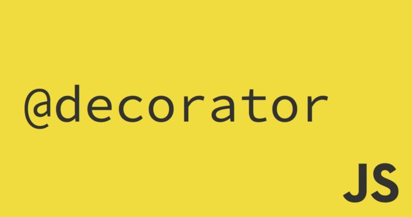

<h1 align="center">
Angular 10 - Basics learning and code.
</h1>

<p align="center">
	
</p>

### Start

+ Install Node and npm.
+ Using Angular CLI 10.0.4 
+ Use ```npm install -g @angular/cli``` to install the latest version using npm.
+ The very basics of Angular App is the ***Modules*** which then contains then contains the ***components***. Each component must contains two things, one is ***template (which is view/HTML)*** and other one is ***Class (A TrypeScript class)***, which contains logic to what's going to render on the Template.
+ As Angular is written using TypeScript, a very basic knowledge of TypeScript is required to work with Angular.

> Do note that Angular is a platform and client side framework which is is used for building single-page clinet applications using HTML and TypeScript.It implements core and optional functionality as a set of TypeScript libraries that you import into your apps.
Please refer [here](https://angular.io/guide/architecture) for more.

+ Do not confuse modules/components/services etc as they are some sort of folders, instead they are Modules, components and services are classes that use decorators. 


### Components

+ Angular components are consits of *componentName.componet.ts*, *componentName.componet.html*,*componentName.componet.css*.
+ run ```ng g c component-name``` or you can also run ```ng generate component component-name```
+ the above command will generate(g) *component-name* component(c) for you inside app folder and also update the file *app.module.ts*.
+ The component module class file (the TypeScript file) is consist of a Decorator ( @Component() ) that will tell Angular app that the just below Class is actually a Component for the app. The @Component() decorator identifies the class immediately below it as a component, and provides the template and related component-specific metadata.

<p align="center">

</p>

> There are many other Decorators available for Angular classes. Decorators are the functions that modify JavaScript classes. They provide some metadata about the class as what that class supposed to do. Decorators (also called annotations) are an experimental (stage 2) JavaScript language feature. TypeScript adds support for decorators.
Angular defines decorators that attach metadata to classes or properties so that it knows what those classes or properties mean and how they should work. 

+ Class decorators are decorator that appears immediately before a class definition, which declares the class to be of the given type, and provides metadata suitable to the type.

The following decorators can declare Angular class types:
```@Component()```,```@Directive()```,```@Pipe()```,```@Injectable()```,```@NgModule()```.

+ Class field decorators are decorator statement immediately before a field in a class definition that declares the type of that field. Some examples are ```@Input``` and ```@Output```.

<p align="center">

</p>

### Data Binding in Angular

+ There are two types of data binding:

**Event binding** lets your app respond to user input in the target environment by updating your application data.

**Property binding** lets you interpolate(insert) values that are computed from your application data into the HTML.

+ Angular supports two-way data binding, meaning that changes in the DOM, such as user choices, are also reflected in your program data.

#### Interpolation

+ With interpolation we can bind data into template. Using ```{{ }}``` we can evaluate expressions (means ```{{2+2}}``` is valid),concatnate strings like ```{{ "Hello "+name }}``` or call methods defined in our class or can call some predefined JavaScript functions too like ```{{name.length}}```.
+ What we can't do with interpolation is that we cannot call global JavaScript funtions like ```{{ window.location.href }}``` is invalid. Also, assignments to the variable here are invalid too. Means ```{{ a = 2+2 }}``` is invalid and give error on console.

#### Property Binding

+ **HTML Attributes and DOM Properties** are not the same. Attribute initialize the DOM properties and that's it. Attributes value cannot change once they are initialized.

+ As we are binding data to the DOM properties and not the HTML attributes in Angular, this distinctions should be clear.

+ let's bind a data to the id property of the input html field:
```<input [id]="myId" type="text" value="Aniket" >```

> What I have done here is binded **myId property** to the attribute id of this input element. Although the attribute is of HTML but the myId property do affaect the DOM insted of attribute, hence it's called property binding.

+ The same can also be done using interpolation as:
```<input id="{{ myId }}" type="text" value="Aniket" >```
The generated source will be same for both.

> ##### Why we need property binding then if we can use interpolation?

Because not all type of values can be bind using interpolation. **Interpolation only works with string values**. HTML attributes do expect some boolean values too.

Example:
```<input id="{{ myId }}" [disabled]="false" type="text" value="Aniket" >``` 


+ Binding also got another syntax like instead of [] you can also use bind-attributeName.
```<input bind-id="myId" type="text" value="Aniket" >```
This is same as ```<input [id]="myId" type="text" value="Aniket" >```
